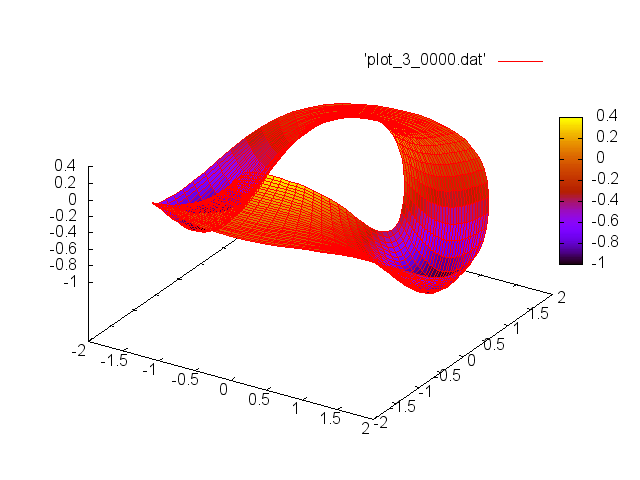

# Summary

The SeLaLib software library is a modular library for kinetic and
gyrokinetic simulations of plasmas in fusion energy devices by
semi-Lagrangian or particle-in-cell methods.

SeLaLib contains a collection of individual building blocks for the
parallel simulation of the Vlasov equations and the gyrokinetic equation
either based on semi-Lagrangian schemes or particle methods. Besides
numerical algorithms the library provides low-level utilities,
input-output modules as well as parallelization strategies. Moreover, a
collection of simulations for typical test cases with various
discretization schemes supplements the library.

# Statement of need

Codes like GYSELA [ref] currently allows to simulate ionic turbulence
in tokamak plasmas by neglecting the temporal variations of the
magnetic field. If you want to take into account not only the
electron dynamics (currently considered adiabatic) but also the
electromagnetic effects and enrich the physics of the model, you need
important improvements of the numerical schemes (multiscale schemes in time and space,
Vlasov-Maxwell resolution instead of Vlasov-Poisson, ...).

One of the difficulties posed by kinetic models for plasmas, including
in particular the Vlasov equation, is that they are posed in phase
space which doubles the dimension (6D for the complete physical
problem which can sometimes be restricted to 4D or 5D thanks to the
existence of symmetries or the decoupling of certain time scales).
The development and validation of a new numerical method is generally
done in a simpler way in small 1D and 2D codes that do not require
parallelization and that allow to run validation test cases in a
few seconds or minutes, unlike real physical cases that require
hours or even days on high-performance computers of national centers.

The SeLaLib project arose from the need of researchers to develop
numerical methods with simplified test cases while also having
independently tested modules that would facilitate gradual changes in
existing production code. While originally envisioned to be specialized
on the semi-lagrangian method, the abstractions that we have built can
be used with other types of approaches, such as particle-in-cell.

Selalib provides an API and a framework designed to handle 
large physical test cases and after validation, offers to the physicists 
the possibility to incorporate directly the software brick in their code.

This well-defined software framework facilitates the efficient
integration of new numerical techniques into a code that can handle
real physical problems. With SeLalib you save a considerable amount
of time in the development and validation process of complex numerical
techniques.

# Mathematics

The software allows to numerically solve a number of mathematical
problems related to the physics of fusion plasmas:

- Vlasov equation:
$$
\partial_t f(t,\mathbf{x},\mathbf{v}) + \mathbf{v}\nabla_{\mathbf{x}} f(t,\mathbf{x},\mathbf{v}) + \frac{q}{m} \mathbf{E}(t,\mathbf{x}) \nabla_{\mathbf{v}} f(t,\mathbf{x},\mathbf{v}) = 0
$$

$$-\Delta \phi(t,\mathbf{x}) =  1- \rho(t, \mathbf{x})$$

- Vlasov--Maxwell

$$\begin{aligned}
    &&\partial_t f(t,x,\mathbf{v}) + v_1 \partial_{x_1} f(t,x,\mathbf{v}) + \mathbf{E}(t, x) \cdot \nabla_{\mathbf{v}} f(t, x, \mathbf{v}) + B v_2 \partial_{v_1} f(t,x,\mathbf{v}) - B v_1 \partial_{v_2} f(t,x,\mathbf{v}) = 0, \\
    && \partial_t B(t,x) = - \partial_{x_1} E_2, \\
    && \partial_t E_2 = - \partial_{x_1} B - \int_{\mathsf{R}^1} v_2 f(t, x, \mathbf{v}) \, \mathrm{d}v,\\
    && \partial_t E_1 = - \int_{\mathsf{R}^1} v_1 f(t, x, \mathbf{v}) \, \mathrm{d}v.\end{aligned}$$

- Guiding center

$$\partial_t f(t,r,\theta) - \frac{\partial_{\theta}\Phi(r, \theta)}{r} \partial_r f(t,r,\theta) +  \frac{\partial_{r}\Phi}{r} \partial_{\theta} f  = 0.$$

- Drift Kinetic

# Citations

Citations to entries in paper.bib should be in
[rMarkdown](http://rmarkdown.rstudio.com/authoring_bibliographies_and_citations.html)
format.

If you want to cite a software repository URL (e.g. something on GitHub without a preferred
citation) then you can do it with the example BibTeX entry below for @fidgit.

For a quick reference, the following citation commands can be used:
- `@author:2001`  ->  "Author et al. (2001)"
- `[@author:2001]` -> "(Author et al., 2001)"
- `[@author1:2001; @author2:2001]` -> "(Author1 et al., 2001; Author2 et al., 2002)"

# Figures

Figures can be included like this:

and referenced from text using \autoref{fig:example}.

Figure sizes can be customized by adding an optional second parameter:
{ width=20% }

# Acknowledgements

Much of `SeLaLib` was implemented by Edwin Chacon-Golcher while he was supported by Inria through the AdT (Aide au développement technologique) selalib of the center Nancy-Grand Est.
We acknowledge contributions from Aliou Diouf, Samuel Santis and Raphael Blanchard while funded also by Inria.

# References
